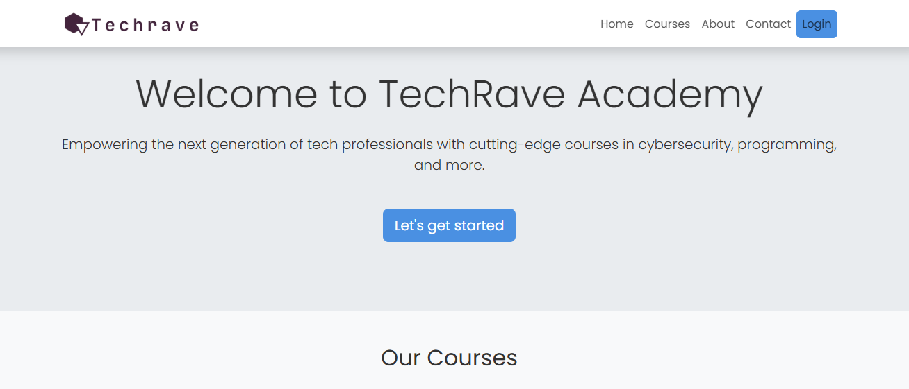
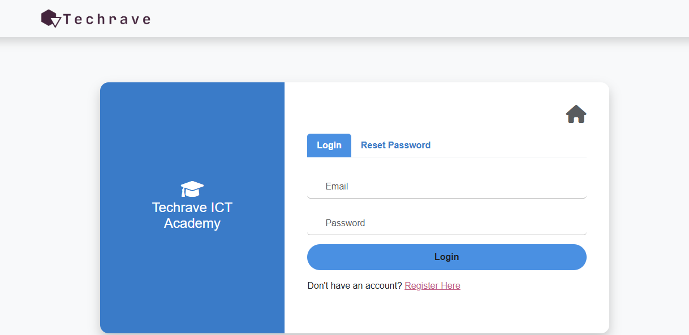
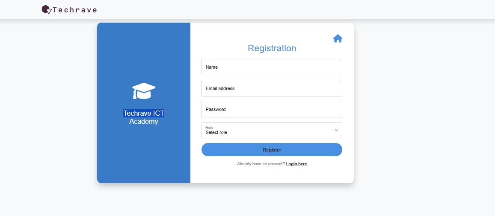
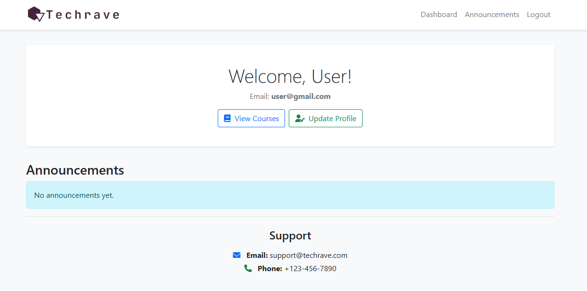
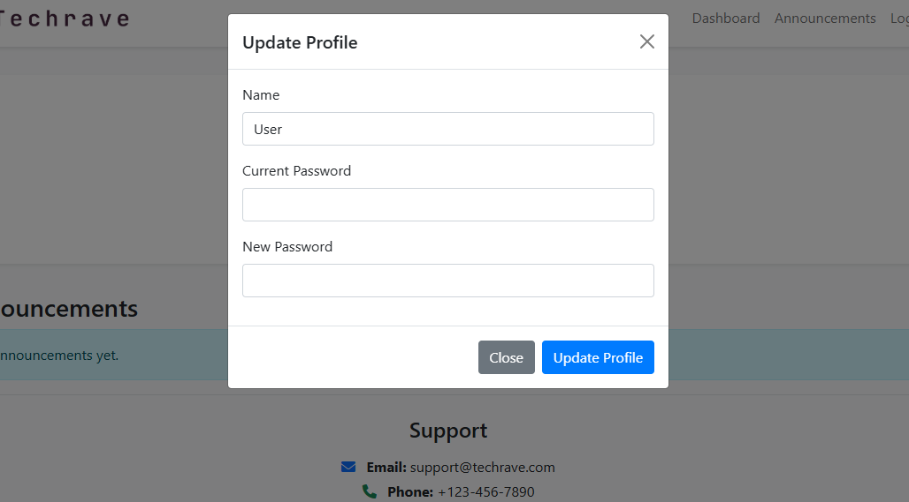
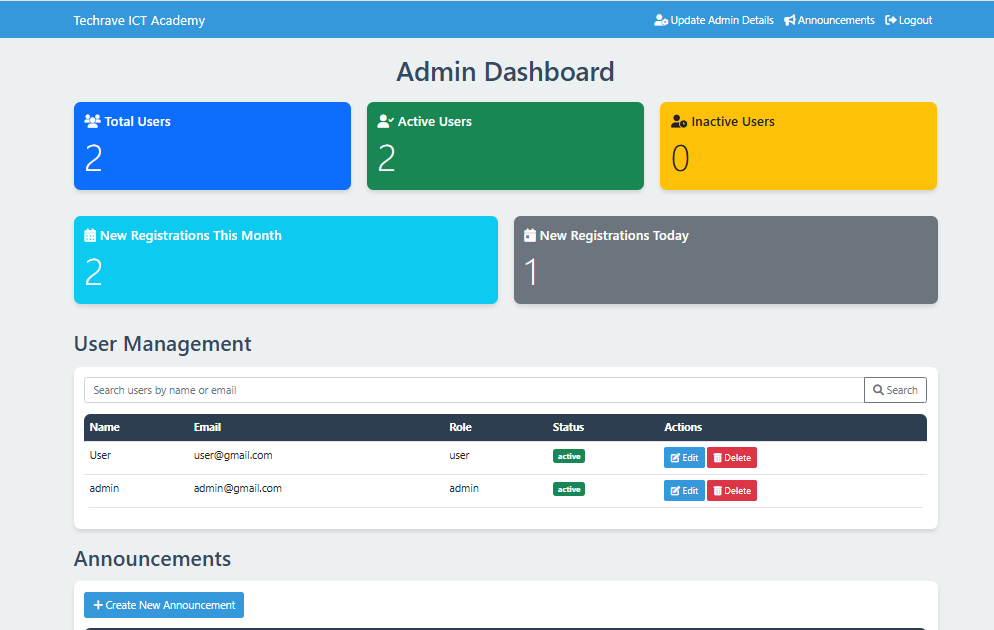

# Techrave ICT Academy

## Overview

Techrave ICT Academy is a web-based platform designed to provide high-quality tech education to students worldwide. The platform consists of a public-facing website, a user dashboard for students, and an admin dashboard for managing the academy's operations.

## Features

### Public Website
- Landing page with information about the academy
- Course listings
- About section
- Contact form

### User Dashboard
- Secure authentication
- Profile management
- View announcements
- Access to course materials (to be implemented)

### Admin Dashboard
- User management (view, edit, delete users)
- Announcement creation and management
- View academy statistics (total users, active users, new registrations)

## Technologies Used

- PHP 7.4+
- MySQL 5.7+
- HTML5
- CSS3
- JavaScript
- Bootstrap 5.1.3
- Font Awesome 6.0.0-beta3

## Installation

1. Clone the repository:
   ```
   git clone https://github.com/your-username/techrave-ict-academy.git
   ```

2. Set up a local web server (e.g., Apache) with PHP support.

3. Create a MySQL database and import the provided SQL schema.

4. Update the database connection details in `db.php`:
   ```php
   $servername = "localhost";
   $username = "your_username";
   $password = "your_password";
   $dbname = "techrave_academy";
   ```

5. Place the project files in your web server's document root.

## Usage

1. Access the public website by navigating to `http://localhost/index.html` in your web browser.

2. Register a new user account (and for admin, make use of the Access Code 1111) or log in with existing credentials.

3. For admin access, log in with admin credentials (create an admin user in the database).

## Screenshots

Here are some screenshots of the Techrave ICT Academy platform:

### Public Website

*Landing page of the public website showcasing the academy's offerings*


*User Login Interface*


*User Registration Interface*

### User Dashboard

*Main dashboard view for registered users*


*User profile management page*

### Admin Dashboard

*Overview of the admin dashboard with key statistics*


*Interface for creating and managing announcements*


## File Structure

- `index.html`: Public-facing landing page
- `user_dashboard.php`: Dashboard for registered users
- `admin_dashboard.php`: Dashboard for administrators
- `db.php`: Database connection file
- `login.php`: User authentication script (to be implemented)
- `register.php`: User registration script (to be implemented)

## Contributing

We welcome contributions to the Techrave ICT Academy project. Please follow these steps to contribute:

1. Fork the repository
2. Create a new branch (`git checkout -b feature/AmazingFeature`)
3. Commit your changes (`git commit -m 'Add some AmazingFeature'`)
4. Push to the branch (`git push origin feature/AmazingFeature`)
5. Open a Pull Request

## License

This project is licensed under the MIT License. See the `LICENSE` file for details.

## Contact

For any inquiries or support, please contact the Techrave ICT Academy team at peacearakunle@gmail.com.

---
